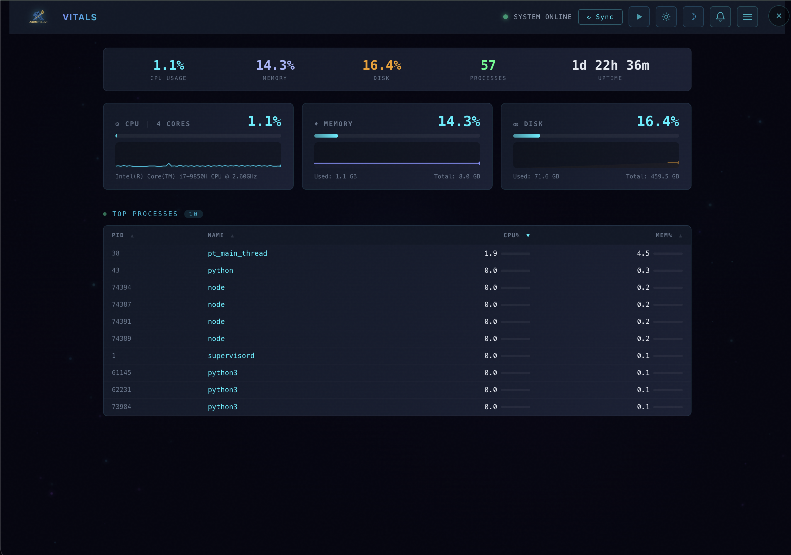
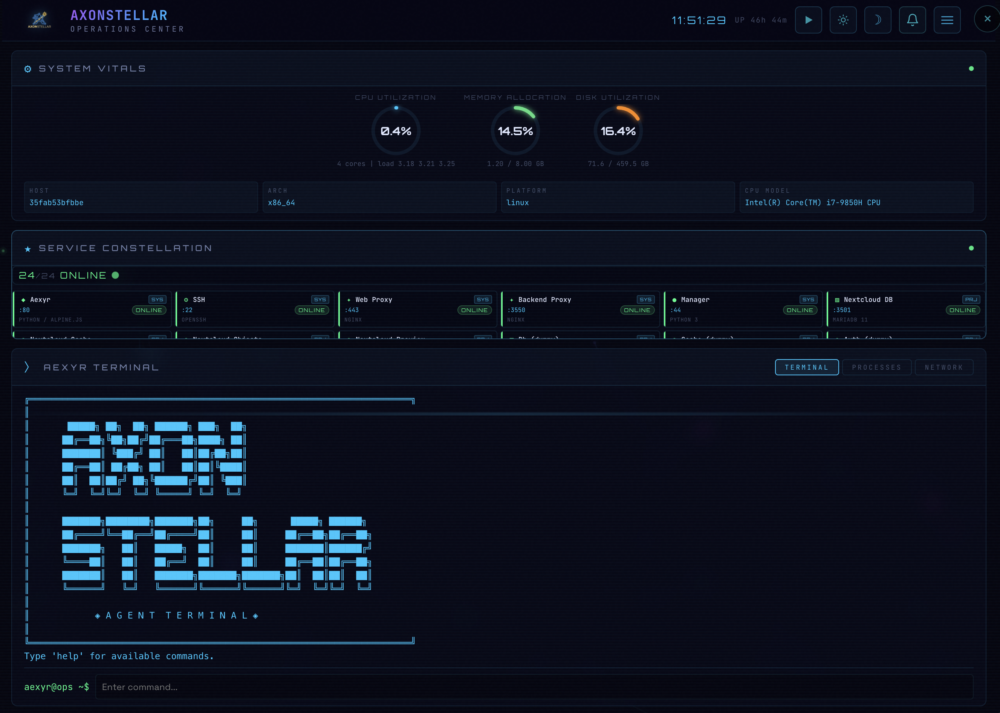
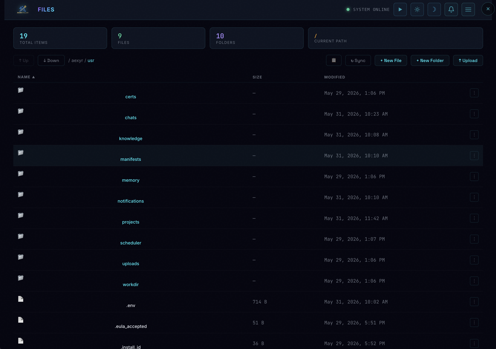

<div align="center">


# Æxyr

**Autonomous Digital Infrastructure Orchestrator**

*Deploy a fully autonomous digital infrastructure orchestrator with a single Docker command.*


---

**[Storefront](https://aexyr-store.axonstellar.ai)** · **[EULA](EULA.md)** · **[Changelog](CHANGELOG.md)** · **[Third-Party Notices](THIRD-PARTY-NOTICES.md)**

</div>

---

## Statement from AxonStellar

> Data sovereignty and privacy aren’t features — they’re rights.
>
> The AI development landscape has consolidated around a familiar pattern: build on someone else’s cloud, store your code on someone else’s servers, and trust that someone else’s terms of service will protect what you’ve created. For individuals and organizations who take data privacy seriously, this isn’t a tradeoff — it’s a dealbreaker.
>
> We built Æxyr because we believe there should be an alternative. A complete autonomous AI platform that runs entirely on your hardware, where your code never leaves your machine, where no telemetry is collected, and where you own every line of output the agent produces. Not as a compromise with fewer features — but as a fully-equipped digital infrastructure orchestrator that happens to respect your sovereignty by design.
>
> AxonStellar isn’t backed by venture capital. We didn’t emerge from a committee or a product roadmap. Æxyr was engineered from first principles by a single architect who refused to accept that powerful AI tooling requires surrendering control of your data. The networking layer, the deterministic port architecture, the biological decision-making protocol, the self-healing infrastructure — these aren’t features borrowed from existing tools. They are original engineering, purpose-built for a world where privacy and capability coexist.
>
> The industry says you need their cloud to build with AI. We disagree.
>
> — **AxonStellar LLC**

---

## Overview

Æxyr (ASH-er) is a self-hosted autonomous AI agent platform that lives inside a Docker container on your hardware. Built on the Open Source Agent Zero Framework, it operates its own Linux environment with scoped access to a terminal, file system, package management, and service orchestration — governed by a biological-inspired safety protocol that gates every action through confidence, safety, and necessity scoring before execution.

This isn’t a terminal-only coding assistant or a cloud-hosted builder that holds your code hostage. Æxyr acts as your digital infrastructure orchestration agent, providing a pathway to iterate and host your own content and services without vendor lock-in or cloud-hosted data privacy concerns; The AxonStellar digital infrastructure includes: a Server Rack for managing services, a Network Topology for visualizing your architecture, an Operations Center for system-level oversight, SSL certificate management via CloudFlare & LetsEncrypt, a file browser, and process monitoring. Your code never leaves your machine.

Tell Æxyr what to build in natural language. It writes production-grade code, configures proxies, provisions SSL certificates, launches services, and ships to production — autonomously. Tell Æxyr to setup monitoring on a service with scheduled tasks so when something breaks, it detects the failure, reads the logs, diagnoses the root cause, applies a targeted fix, and documents the incident.

Æxyr spawns specialized sub-agents — developer, researcher, and security profiles — running in parallel through a synaptic delegation protocol. Pre-built workflow playbooks (Engrams) encode operational expertise: deploy full-stack services, provision infrastructure, remediate failures, or run health scans across your constellation. Persistent vector memory recalls solutions and patterns across sessions permanently.

One autonomous digital infrastructure orchestrator. Self-hosted. Fully yours. No subscriptions, no cloud bills, no lock-in.

```bash
docker run -d --name aexyr -p 9594:80 ghcr.io/axonstellar/aexyr:latest
```

Open `http://localhost:9594` → Login with `admin` / `aexyr` → Add an API key in Settings → Start building.

---

## Screenshots

### Agent Chat — Dark Theme
The main interface. Converse with Æxyr, assign tasks, and watch it work in real time. Code execution, file creation, web browsing, and multi-agent delegation all happen inline.


### Network Topology
Live visualization of your entire service constellation. Every running service, LLM provider, SSL certificate, and infrastructure component appears as an interactive view. Drag nodes to arrange your constellation — positions are saved persistently, letting you design a layout that reflects your architecture. Click any node to inspect its health, view configuration, or tail logs in real time. Connection lines trace data flow, API calls, and dependencies between services, giving you an at-a-glance understanding of how everything fits together.


### Server Rack
Your constellation command center. Every deployed service appears as a live card showing port, health status, and resource usage. Start, stop, and restart any service with one click. Built-in workflow playbooks (Engrams) are accessible directly from each service card — run diagnostics, export configurations, inspect logs, or execute remediation steps without leaving the dashboard. As your constellation grows, the rack gives you a unified control plane for managing every node in your architecture.


### System Vitals
CPU, memory, disk, and process monitoring with historical charts. Identify resource-hungry processes and track system health over time.



### Neural Core
Inspired by biological neural networks, the Action Potential Protocol is Æxyr’s constraint and decision-making engine. Before executing any autonomous action, three dendrite signals fire — Confidence, Safety, and Necessity — each weighted and summed against a threshold bias. If the activation crosses the threshold, the axon fires and the action executes. If not, Æxyr pauses and asks for guidance. Destructive actions like file deletion or system changes receive full signal calculation with strict safety weighting, while read-only operations auto-approve. A development mode lowers thresholds for creative work. Every decision is transparent — you can see exactly why the agent chose to act or hold back.


### Operations Center
System-level operations dashboard. Network listeners, nginx proxy configuration, process management, and terminal access in one view.



### SSL Certificate Management
End-to-end SSL lifecycle management powered by Let’s Encrypt and Cloudflare DNS-01 validation. Provision certificates with a single command — the platform handles domain verification, certificate generation, nginx configuration, and domain-to-service binding automatically. The certificate chain and domain verification status are visualized in the UI, with renewal tracking and automated renewal ensuring certificates never expire unnoticed.

Æxyr can provision and assign SSL certificates autonomously as part of any deployment workflow.


### File Manager
Browse, edit, upload, and download files across the entire user space. Syntax-highlighted editor with support for all common file types.



---

## Features

### Autonomous Agent
- **Multi-step task execution** — breaks down complex tasks, executes each step, verifies results
- **Code execution** — writes and runs Python, Node.js, and shell commands in a live Linux environment
- **Web browsing** — autonomous browser agent for research, data extraction, and interaction
- **Multi-agent orchestration** — spawns specialized sub-agents (developer, researcher, hacker profiles) for parallel work
- **Long-term memory** — FAISS vector database for persistent knowledge across conversations
- **File & project management** — creates, edits, and organizes files and full project structures

### Multi-Provider LLM Support

Connect to different LLM providers out of the box — from cloud API services offering hundreds of frontier and open-source models to fully local inference with zero API cost. Mix and match providers across tasks: assign one model for conversation, another for utility work, and a third for autonomous browsing. Switch providers at any time through Settings without restarting.

### AxonStellar Platform
| Module | Purpose |
|---|---|
| **Server Rack** | Constellation command center with live service cards, one-click lifecycle controls, and integrated workflow playbooks |
| **Topology** | Interactive constellation map with persistent node placement, live health, and connection tracing |
| **Manifests** | Persistent service registry with auto-discovery |
| **Vitals** | CPU, memory, disk monitoring with historical charts |
| **Ops Center** | Network, nginx, process management, terminal |
| **Neural Core** | Action Potential Protocol — biological decision-making engine with transparent signal calculation |
| **SSL Management** | Let’s Encrypt + Cloudflare DNS-01 provisioning, automatic nginx binding, certificate chain visualization, renewal tracking |
| **Files** | Full file manager with syntax-highlighted editor |
| **Tasks** | Scheduled and ad-hoc autonomous task execution |
| **Engrams** | Pre-built workflow playbooks for common operations |
| **Notifications** | Platform-wide alerting system |
| **Page Builder** | Visual web service designer with deploy-to-production |

### Infrastructure
- **Nginx reverse proxy** with automatic SSL configuration
- **Cloudflare Tunnel** support for secure external access (no port forwarding)
- **Process Manager** for service lifecycle management
- **Multi-service deployment** — run databases, caches, APIs, and full-stack apps inside the container
- **Port allocation** — services on 9551-9580, microservices on derived 35xx ports

### Security
- **Container hardening** — `cap_drop: NET_RAW`, `no-new-privileges`, iptables egress rules
- **Authentication** — session-based login with configurable credentials
- **EULA enforcement** — mandatory acceptance gate before platform access
- **License signing** — cryptographically verified license keys
- **Source protection** — critical modules compiled with Encryption

---

## Quick Start

### Prerequisites

- **Docker** 20.10+ installed
- **An API key** from at least one supported LLM provider

### Docker Run

```bash
docker run -d --name aexyr -p 9594:80 \
  -v aexyr-data:/aexyr/usr \
  -v aexyr-logs:/aexyr/logs \
  -v aexyr-tmp:/aexyr/tmp \
  -v aexyr-data2:/aexyr/data \
  ghcr.io/axonstellar/aexyr:latest
```

### Docker Compose

Create a `docker-compose.yml`:

```yaml
services:
  aexyr:
    container_name: aexyr-agent
    image: ghcr.io/axonstellar/aexyr:latest
    restart: unless-stopped
    ports:
      - "9594:80"
    volumes:
      - aexyr-data:/aexyr/usr
      - aexyr-logs:/aexyr/logs
      - aexyr-tmp:/aexyr/tmp
      - aexyr-data2:/aexyr/data
    environment:
      - AUTH_LOGIN=admin
      - AUTH_PASSWORD=aexyr
    mem_limit: 8g
    cpus: 4.0

volumes:
  aexyr-data:
  aexyr-logs:
  aexyr-tmp:
  aexyr-data2:
```

```bash
docker compose up -d
```

### ARM64 architecture

```bash
docker run -d --name aexyr -p 9594:80 \
  -v aexyr-data:/aexyr/usr \
  -v aexyr-logs:/aexyr/logs \
  -v aexyr-tmp:/aexyr/tmp \
  -v aexyr-data2:/aexyr/data \
  ghcr.io/axonstellar/aexyr:latest-arm64
```

Multi-arch manifests are available — `ghcr.io/axonstellar/aexyr:latest` auto-selects the correct architecture on most systems.

### First Login

1. Open `http://localhost:9594`
2. Login: `admin` / `aexyr`
3. Go to **Settings** → add your LLM provider API key
4. Start chatting — Æxyr is ready to work

---

## Architecture

| Layer | Technology |
|---|---|
| **Backend** | Python (Flask + Socket.IO + Uvicorn) |
| **Frontend** | Alpine.js + Vanilla JS + HTML/CSS |
| **Proxy** | Nginx (reverse proxy, SSL termination) |
| **Memory** | FAISS vector database |
| **Process Management** | Supervisor + custom Process Manager |
| **Container** | Docker (Kali Linux base) |
| **Browser** | Playwright (Chromium) |

---

## Persistent Volumes

| Volume | Container Path | Purpose |
|---|---|---|
| `aexyr-data` | `/aexyr/usr` | User data, projects, chats, memory, settings |
| `aexyr-logs` | `/aexyr/logs` | Service and application logs |
| `aexyr-tmp` | `/aexyr/tmp` | Temporary files |
| `aexyr-data2` | `/aexyr/data` | Certificates and assignments |

All data persists across container restarts and upgrades.

---

## Pricing

| | Trial | Licensed |
|---|---|---|
| **Price** | Free | **$49.99** (one-time) |
| **Duration** | 10 days | Permanent |
| **Features** | Full platform access | Full platform access |
| **Binding** | — | One license per instance |
| **Activation** | Automatic | Online (once), then fully offline |

Purchase at **[aexyr-store.axonstellar.ai](https://aexyr-store.axonstellar.ai)**

---

## Environment Variables

| Variable | Default | Description |
|---|---|---|
| `AUTH_LOGIN` | `admin` | Web UI username |
| `AUTH_PASSWORD` | `aexyr` | Web UI password |
| `AEXYR_WEB_PORT` | `9594` | Host port mapping |
| `AEXYR_MEM_LIMIT` | `8g` | Container memory limit |
| `AEXYR_CPUS` | `4.0` | Container CPU limit |

API keys are configured through the Settings page after login — not via environment variables.

---

## Updates

Æxyr is provided as-is at the current release version. Future releases are planned — follow this repository or visit the [storefront](https://aexyr-store.axonstellar.ai/news.html) for announcements.

---

## Support

- **Email:** contact@axonstellar.com
- **Issues:** [GitHub Issues](https://github.com/axonstellar/AEXYR/issues)

---

## License

Æxyr is proprietary software published by **AxonStellar LLC**.

**Every installation includes a 10-day free trial with full, unrestricted access to the entire platform.** No credit card required, no feature gates, no limitations. A live countdown banner tracks your remaining trial time.

After the trial period, a license gate activates and platform access requires a purchased license key. A one-time payment of **$49.99** grants a permanent license — no subscriptions, no recurring fees, no expiration. The trial period serves as your complete evaluation window.

Usage is governed by the [End User License Agreement (EULA)](https://aexyr-store.axonstellar.ai/license.html).

See [Third-Party Software Notices](https://aexyr-store.axonstellar.ai/license.html#third-party-software-notices) for open-source component attributions.

---

<div align="center">

*Synaptic grid synced. All nodes online. Traffic is flowing.* 🚀

**[Get Started →](https://aexyr-store.axonstellar.ai)**

</div>